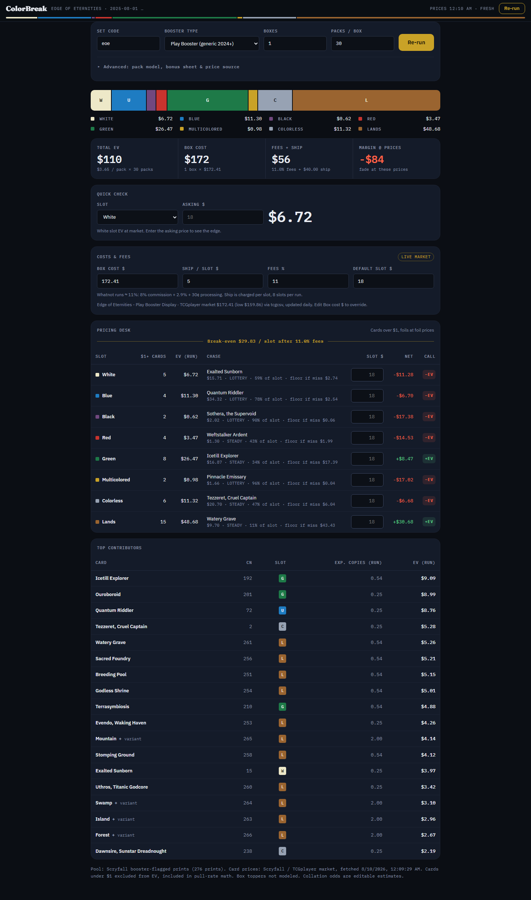

# ColorBreak

**The price board for MTG color breaks.** Type a set code and ColorBreak prices all
8 Whatnot break slots — White, Blue, Black, Red, Green, Multicolored, Colorless, Lands —
from live market data: per-slot expected value, the chase card each slot rides on, and
your break-even after fees.



No other MTG EV tool splits value by color slot. That split is the whole product.

## What it answers

- **Sellers, pre-show:** what does each slot have to sell for so the run clears box
  cost + ~11% Whatnot fees + shipping? The gold break-even line and the margin tile
  answer it at a glance.
- **Buyers, mid-auction:** is "Green at $22" +EV or a fade? Quick check gives a verdict
  in one glance — and tells you whether the slot's EV is one lottery card or steady
  spread (LOTTERY / STEADY, with the floor if the chase misses).

## Using it

1. Open the page (works from a plain `file://` open, GitHub Pages, or any static host).
2. Enter a set code (`eoe`, `blb`, …) or tap a recent set, pick the booster type, Load board.
3. Type your actual slot prices into the desk — net and call update as you type.
4. Share a live board with `?set=eoe&preset=play` in the URL.

Data: card pool and prices from [Scryfall](https://scryfall.com) (TCGplayer market),
sealed box prices from [tcgcsv.com](https://tcgcsv.com). Sealed lookups run through
public CORS relays; for a permanent route, deploy the one-file Cloudflare Worker shown
under **Advanced** and paste its URL there. Cards under $1 count toward pull rates but
not EV. Collation odds are editable estimates under Advanced — WotC doesn't publish
exact numbers.

Everything is one `index.html`: vanilla JS, no build step, state in `localStorage`.
Design decisions live in [DESIGN.md](DESIGN.md).

## Development

Pure logic in `index.html` is fenced with `// @pure … // @end-pure` comments.
`test/extract.mjs` lifts those blocks out of the page verbatim (no build step) so
unit tests run against the exact shipped code:

```
node --test
```

Browser acceptance checks (standing gates G1–G4, iPhone 15 Pro Max descriptor) live in
`test/e2e/`; they need a local Playwright install — point `PLAYWRIGHT_DIR` at a
directory whose `node_modules` contains `playwright`, then `node test/e2e/run-all.mjs`.
The `test/` directory is repo-only; nothing in it ships to the page.
