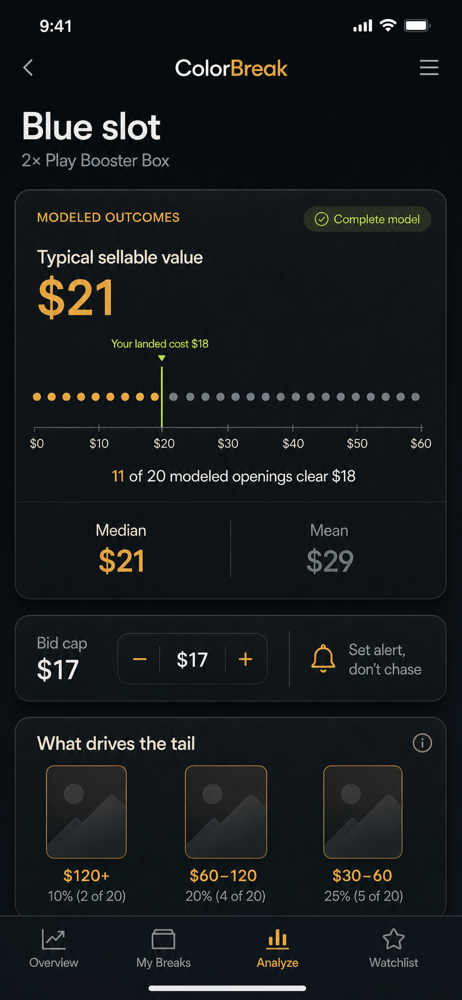
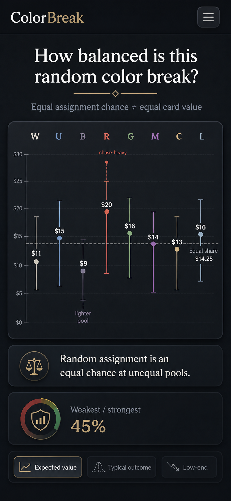
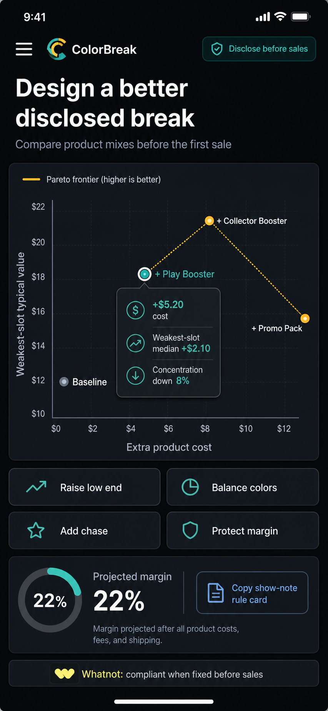

# ColorBreak visualization specifications

These examples communicate product intent, not final pixel-perfect UI. The shipped UI implements compact mobile versions; future iterations should preserve the definitions and warnings below.

## Outcome Fingerprint and Bid Guardrail

**Plain English:** Twenty dots make the frequency concrete. If 11 are beyond the landed-cost marker, roughly 11 of 20 modeled outcomes cover that cost. Median is the typical modeled result; mean is shown separately because rare hits can pull it upward.

**Metrics:** equal-frequency 5% bins, P10, P50, arithmetic mean, P90, landed cost, chance to clear, and expected shortfall. Representative outcomes must be sampled from the displayed tail band, not handpicked chase lists.

**Alt text:** Dark mobile decision card and desktop distribution view showing twenty outcome dots, percentile labels, a cost marker, and conservative-to-chase bid regions.

**Misinterpretation warning:** This is a modeled distribution across openings, not a prediction of the next break. “More conservative” is not “safe,” and chance to clear excludes ignored-bulk cards and selling costs unless stated.

## Break Balance

**Plain English:** Every remaining color may be equally likely to be assigned, but the card-value pools can differ. Bars and whiskers show which remaining colors are lighter, stronger, or more chase-dependent.

**Metrics:** slot share of pooled mean EV, median, P10–P90, weakest/strongest ratio, Gini-style dispersion, and transparent chase-concentration thresholds.

**Alt text:** Eight color-slot columns around an equal-share reference line, with uncertainty whiskers and labels for stronger, weaker, and chase-heavy pools.

**Misinterpretation warning:** Dispersion is not a moral fairness grade. Equal random assignment can coexist with unequal slot value, and estimates inherit all disclosed product and collation evidence limits.

## Enticement Frontier

**Plain English:** Each point compares what an addition costs the seller with how much it improves a chosen buyer outcome. The frontier identifies options that are not both more expensive and less effective than another option.

**Metrics:** incremental acquisition and fulfillment cost, weakest-slot median or P10 improvement, balance improvement, tail increase, margin delta, concentration delta, compliance state, and Pareto dominance.

**Alt text:** Scatter plot of seller cost against buyer-outcome improvement, with product-addition scenario points, a highlighted Pareto frontier, margin notes, and compliance badges.

**Misinterpretation warning:** A frontier point is efficient only for the selected metric and assumptions. It is not automatically profitable, compliant, or best for every audience. Prohibited and approval-required scenarios remain visibly marked and cannot produce compliant show notes.
